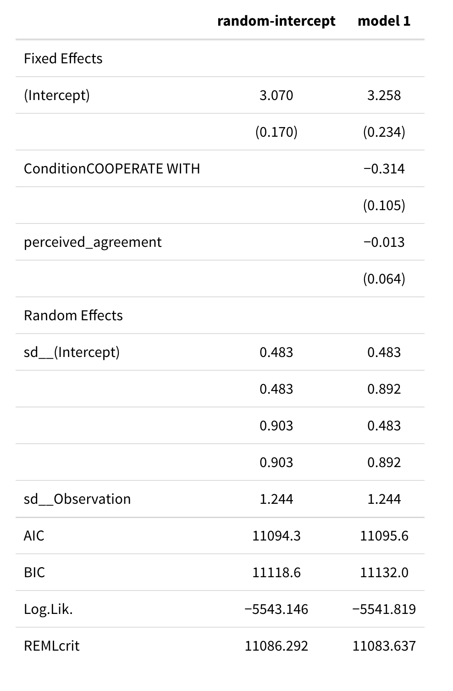

```{r setup, include=FALSE}
knitr::opts_chunk$set(echo = TRUE)
```
  

```{r load-pkg, include=FALSE}
# Add additional packages you need
library(tidyverse)
library(here)
library(haven)
library(lme4)
library(lmerTest)
library(broom.mixed)
library(MuMIn)
library(modelsummary)
library(interactions)
library(sjPlot)  # for plotting effects
library(glmmTMB) #for longitudinal analysis

```

##### Load and examine data

```{r load data, echo = FALSE}
data <- read_csv(here("data_files/metaethics_V2_long.csv"))
head(data)
data.clean <- data%>%
  select(id, Condition, statement, objectivism.rating,
         affiliate_ratings_6.ct,
         mutual_agreement, perceived_agreement)
data.clean%>%
  select(Condition, affiliate_ratings_6.ct, objectivism.rating,
         mutual_agreement, perceived_agreement)%>%
  psych::pairs.panels(ellipses = FALSE, cex = 0.2, cex.cor = 1)
```

#### Testing model assumptions

##### ICC 

```{r assumptions: ICC}
#Baseline model
m0 <- lmer(objectivism.rating ~ (1|statement) + (1|id), data = data)
vc_m0 <- as.data.frame(VarCorr(m0))
# ICC/Deff (person; cluster size = 9)
icc_person <- vc_m0$vcov[1] / sum(vc_m0$vcov)
# ICC (item; cluster size = 367)
icc_item <- vc_m0$vcov[2] / sum(vc_m0$vcov)
# ICC (person + item) 
c("ICC(person + item)" = sum(vc_m0$vcov[1:2]) / sum(vc_m0$vcov)) #.40

#ICC andd design effect for person
c("ICC(person)" = icc_person,
  "Deff(person)" = (1 - icc_item) + (9 - 1) * icc_person)

#ICC and design effect for item
c("ICC(item)" = icc_item,
  "Deff(item)" = (1 - icc_person) + (367 - 1) * icc_item)

```

ICC for `person` is .31, which means that 31% of the variance in objectivity rating was at the between-person level. The corresponding design effect was 3.42.

ICC for `item` is .09, meaning that 9% of the variance in objectivity rating was at the between-item level. The corresponding design effect was 33.61.

Since both design effects are larger than 1.1, we include both the person and item levels in our multilevel model.


##### Visualizing the Data

The figure below shows the variation in objectivism rating at both the person and item levels.

```{r ICC visualization, echo = FALSE}
set.seed(2124)
# Variation across persons
random_ids <- sample(unique(data.clean$id), size = 10)
data.clean %>%
    filter(id %in% random_ids) %>%  # select only 10 persons
    ggplot(aes(x = factor(id), y = objectivism.rating)) +
    geom_jitter(height = 0, width = 0.2, alpha = 0.3) +
    # Add person means
    stat_summary(
      fun = "mean",
      geom = "point",
      col = "red",
      shape = 17,  # use triangles
      size = 4  # make them larger
    ) +
    # change axis labels
    labs(x = "Person ID", y = "Objectivism Rating")

#Variation across items
data.clean %>%
    ggplot(aes(x = factor(statement), y = objectivism.rating)) +
    geom_jitter(height = .1, width = 0.2, alpha = 0.1) +
    # Add person means
    stat_summary(
      fun = "mean",
      geom = "point",
      col = "red",
      shape = 17,  # use triangles
      size = 4  # make them larger
    ) +
    # change axis labels
    labs(x = "Statement", y = "Objectivism Rating")
```


##### Model Equations


Repeated-Measure level (Lv 1):
$$\text{objectivism}_{j,k} = \beta_{j, k} + e_{jk}$$
Between-cell (Person $\times$ Item) level (Lv 2):
$$\beta_{0(j, k)} = \gamma_{00} + \beta_{1k}Condition + \beta_{2k}perceived\_agreement + u_{0j} + v_{0k}$$
Person level (Lv 2a) random slopes
$$
\begin{aligned}
  \beta_{1k} = \gamma_{10} + u_{1j}
\end{aligned}
$$
Item level (Lv2b) random slopes
$$\beta_{2k} = \gamma_{20} + v_{2k}$$


##### Baseline model


First, we fit a random-intercept model using condition at the person-level and perceived agreement at the item-level to predict objectivism ratings. 

```{r model without random slopes, message=FALSE, warning=FALSE}
# Fit a linear growth model with no random slopes
m1 <- lmer(objectivism.rating ~ Condition + perceived_agreement + (1|statement) + (1|id), data = data)
summary(m1)
confint(m1, parm = "beta_")

```


##### Linearity

```{r assumptions: linearity}
augment(m1) %>%
  ggplot(aes(x = jitter(perceived_agreement), y = objectivism.rating)) +
  geom_point(size = 0.7, alpha = 0.3) +
  geom_smooth(col = "blue", se = FALSE) + # blue line from data
  geom_smooth(aes(y = .fitted),
    col = "red",
    se = FALSE, linetype = "dashed"
  )  # red line from model

```
The marginal model plot above shows the outcome variable, objectivism rating, against the predictor perceived agreement. The lines are roughly similar to each other, so there is no need to include extra curvillinear terms.

##### Homogeneity of variance
```{r homogeneity}
augment(m1) %>%
  ggplot(aes(x = factor(id), y = .resid)) +
  geom_boxplot() +
  coord_flip()

augment(m1) %>%
  mutate(.std_resid = resid(m1, scaled = TRUE)) %>%
  ggplot(aes(x = Condition, y = .std_resid)) +
  # use `geom_jitter` for discrete predictor
  geom_jitter(size = 0.7, alpha = 0.5, width = 0.05)
```
Here, we see that most of the standardized residuals are between -3 and 3, so there are not a lot of outliers. Also, the variability of the residuals looks roughly similar across clusters.

##### Normality
```{r normality}
library(lattice)  # need this package to use the built-in functions
qqmath(m1)  # just use the `qqmath()` function on the fitted model

qqmath(ranef(m1, condVar = FALSE),
       panel = function(x) {
         panel.qqmath(x)
         panel.qqmathline(x)
       })

```
In the Q-Q plots above, we see the residuals roughly follow the 45-degree line, so normality does not appear to be an issue.


##### Summary table




##### Testing random slopes

We then test random slopes for `Condition` at the `person` level and for `perceived agreement` at the `person` level

```{r model with condition, message=FALSE, warning=FALSE}
# Fit a linear growth model with random slope= of time
m1.rs1 <- lmer(objectivism.rating ~ Condition + perceived_agreement + (Condition|statement) + (1|id), data = data, 
               control = lmerControl()
)

m1.rs2 <- lmer(objectivism.rating ~ Condition + perceived_agreement + (perceived_agreement|statement) + (1|id), data = data
)

#test
ranova(m1.rs1)
ranova(m1.rs2)

```

Neither the random slopes for `Condition` nor 'perceived_agreement' were significant.

##### Plots

```{R}
plot_model(m1,
    type = "pred", terms = "Condition",
    show.data = TRUE, jitter = 0.1,
    title = "", dot.size = 0.8
)

plot_model(m1,
    type = "pred", terms = "perceived_agreement",
    show.data = TRUE, jitter = 0.1,
    title = "", dot.size = 0.8
)

interact_plot(m1,
              pred = "perceived_agreement",
              modx = "Condition",
              plot.points = TRUE,
              point.size = 0.5,
              point.alpha = 0.2,
              x.label = "Perceived Agreement with Target",
              y.label = "Objectivism Rating",
              jitter = 0.1
)
```

##### Summary


We examined the prediction of objectivism ratings using predictors of condition (cooperate or compete) and perceived agreement (how much subjects thought they agreed with the other person on a given item). Main effects for these variables were examined, and condition emerged as a significant predictor. In particular, our model predicts that those in the cooperation condition would report an objectivism rating of 0.31 units lower than those in the competition condition, 95% CI [-0.52, -0.11]. The model also predicts that for every increase in perceived agreement rating, objectism rating would decrease by 0.013 units, 95% CI [-0.14, 0.11], though this effect did not reach significance. Random slopes for subject and item did not reach significance, so we excluded them from our model. 


